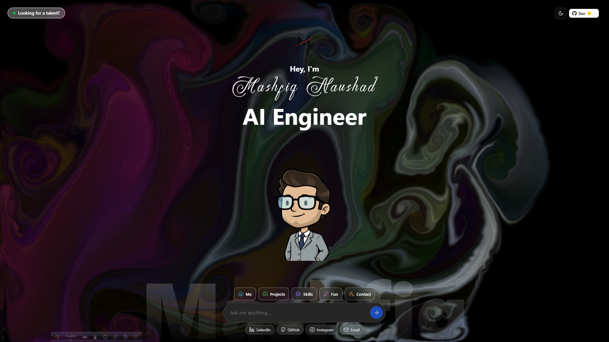
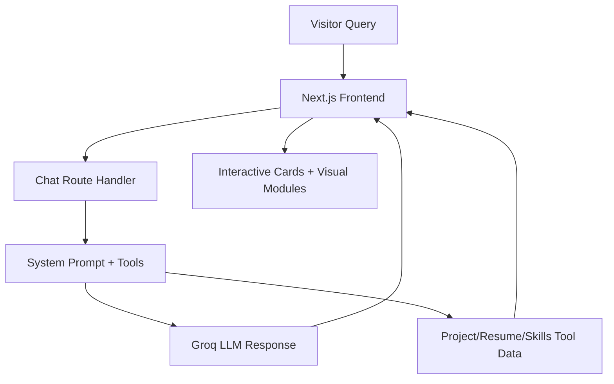
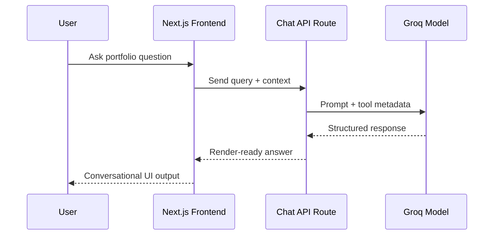

<div align="center">


<p>
	
</p>

[](https://maashfiiiiq.vercel.app)
[](https://nextjs.org/)
[](https://react.dev/)
[](https://www.typescriptlang.org/)
[](LICENSE)

</div>

## Identity

<div align="center">


</div>

## Product Vision

This repository contains my AI-native portfolio built as an interactive conversation system.
Instead of static scrolling sections, visitors can ask focused questions and receive direct, contextual answers about my projects, technical stack, work experience, and goals.

## Product Snapshot

<div align="center">
	
</div>

## Experience Highlights

- AI/ML Engineer at BRITTOO.XYZ (Sept 2025 - Present)
- Software Engineering Intern at VIVASOFT LIMITED (Jan 2026 - Present)
- Hands-on work with NLP pipelines, semantic search, RAG, Go services, and production AI integration

## System Capabilities

- Context-aware conversational answers through a guided system prompt
- Tool-assisted responses for projects, skills, resume, and profile sections
- Interactive game modules (song, movie, chess) to increase engagement
- Mobile and desktop optimized interaction flow

## Project Highlights

- EDUPREDICT - AI Performance Analysis Platform
- Smart Rural Health Assistant
- HoloHype - Immersive Commerce Interface
- YouTube UI Clone

## Architecture



### Architecture Layers

| Layer | Responsibility | Tech |
|---|---|---|
| Interface Layer | Landing, chat, cards, responsive rendering | Next.js, React, Tailwind CSS, Framer Motion |
| Orchestration Layer | Prompting, route handlers, tool execution | Next.js API Routes, AI SDK |
| Intelligence Layer | Conversational response generation | Groq models |
| Content Layer | Projects, profile, skills, resume modules | TypeScript data/components |
| Delivery Layer | Build, deploy, environment security | Vercel, Node 20.x |

## Deployment Architecture

```text
User Browser -> Vercel Edge -> Next.js App Router -> API Route Handlers -> Groq / External APIs
```

- Primary production host: Vercel
- Runtime target: Node 20.x
- Secrets scope: deployment environment variables only

## Folder Structure

```text
ai-native-portfolio/
|- src/
|  |- app/
|  |  |- api/
|  |  |  |- chat/
|  |  |  |- games/
|  |  |  \- github-stars/
|  |  |- chat/
|  |  |- fonts/
|  |  |- layout.tsx
|  |  \- page.tsx
|  |- components/
|  |  |- chat/
|  |  |- projects/
|  |  |- ui/
|  |  \- *.tsx modules
|  |- hooks/
|  \- lib/
|- public/
|  \- projects/, media, logos, resume assets
|- assets/
|- .github/
|- README.md
|- LICENSE
\- package.json
```

### Structure Mapping

| Directory | Purpose |
|---|---|
| `src/app` | App Router pages, layout, and API endpoints |
| `src/components` | Reusable UI blocks and feature modules |
| `src/components/chat` | Chat UX, drawer tools, and game explorer |
| `src/components/projects` | Project showcase cards and project content data |
| `public` | Static assets (images, videos, logos, docs) |
| `.github` | Repository policy and security docs |

## Tech Stack

| Category | Technologies |
|---|---|
| Frontend | Next.js, React, TypeScript |
| UI/UX | Tailwind CSS, shadcn/ui patterns, Framer Motion |
| AI | AI SDK, Groq |
| Backend | Next.js route handlers |
| Tooling | ESLint, PNPM |
| Deployment | Vercel |

<div align="center">
	
</div>

## Live Metrics

<div align="center">
	
	
</div>

<div align="center">
	
</div>

### Portfolio KPI Snapshot

| KPI | Focus |
|---|---|
| Response Experience | Conversation-first portfolio navigation |
| Build Stack | Production-grade React/Next TypeScript architecture |
| AI Layer | Tool-assisted responses with Groq-backed reasoning |
| Deployment | Vercel-hosted, environment-secured runtime |

## Interaction Flow



## Security and Privacy

- No hardcoded runtime secrets.
- Environment variables are used for provider credentials.
- Sensitive provider calls are server-side.
- Security response process is documented in [.github/SECURITY.md](.github/SECURITY.md).

## Operations and Monitoring

- Runtime health checks are enabled for portfolio uptime tracking.
- Monitoring-friendly endpoint is available for external probes.
- Production inference runs on an upgraded Groq usage profile for stable response quality.

Quick check:

```bash
curl http://localhost:3000/api/health
pnpm health:check
```

### Vercel Environment Checklist

- `GROQ_API_KEY` set in Production/Preview/Development
- `TMDB_API_KEY` set in Production/Preview/Development
- `GITHUB_REPO` set to `NuhashMaq/Portfolio_Maashfiiiiq`
- Optional `GITHUB_TOKEN` configured to reduce GitHub API rate limits

## Local Development

1. Clone repository

```bash
git clone https://github.com/NuhashMaq/Portfolio_Maashfiiiiq.git
cd Portfolio_Maashfiiiiq
```

2. Install dependencies

```bash
pnpm install
```

3. Configure `.env.local`

```env
GROQ_API_KEY=your_groq_api_key
TMDB_API_KEY=your_tmdb_api_key
GITHUB_TOKEN=your_github_token_optional
GITHUB_REPO=NuhashMaq/Portfolio_Maashfiiiiq
```

4. Run

```bash
pnpm dev
```

5. Open

```text
http://localhost:3000
```

## Connect

- Website: https://maashfiiiiq.vercel.app
- GitHub: https://github.com/NuhashMaq
- LinkedIn: https://www.linkedin.com/in/mashfiqnaushad/
- Instagram: https://www.instagram.com/__maashfiiiiq__/
- Email: mashfiq.cse.ruet@gmail.com

## License

This project is licensed under the Mashfiq Naushad Personal Portfolio License (MNPPL) v1.0.
See [LICENSE](LICENSE) for terms.

<div align="center">
	
</div>
